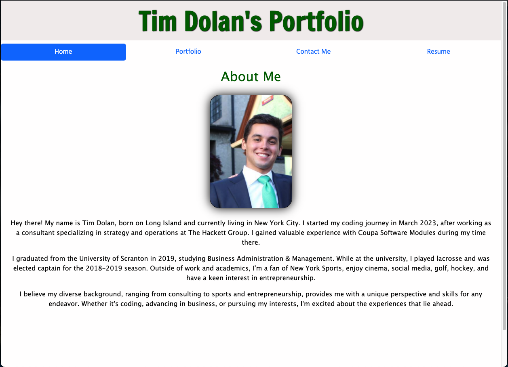

# React Portfolio

## Deployed Portfolio
https://timdolan14.github.io/React-Portfolio/

## Github Repo
https://github.com/timdolan14/React-Portfolio

## Description 

This personal portfolio page is built using React and its wide range of features, resulting in an engaging and interactive website for all users. The portfolio is organized into four distinct sections: a home page with a brief bio about the owner, a portfolio showcasing selected projects with both deployed URLs and GitHub links, a downloadable resume, and a contact form to facilitate easy communication. 

## Usage 
To review this Site Creation, you can review the notes in each section. Open the Chrome DevTools by pressing Command+Option+I (macOS) or Control+Shift+I (Windows). A console panel should open either below or to the side of the webpage in the browser.

## Credits
N/a

## License
N/a